  

# Ankitesh Tiwari

> **AI Developer &amp; Full-Stack SaaS Builder** &bull; Turning research and agentic systems into practical, production-ready software.

  
  
  

I work at the convergence of <strong>Agentic AI, LLM Evaluation, and Full-Stack SaaS Engineering</strong>. Whether it's training and evaluating frontier AGI systems, publishing medical AI research, or building SaaS from scratch, I focus on software that actually ships and solves operational problems.

<ul>
  <li><strong>Building:</strong> <samp>DealCrew</samp> &mdash; Intelligent deal management &amp; workflow automation platform.</li>
  <li><strong>Research &amp; Expert Work:</strong> ML Expert at Snorkel AI &amp; Model Evaluator for LLM Alignment &amp; Reasoning.</li>
  <li><strong>Focus Areas:</strong> Agentic Architectures, AGI Benchmarking, Medical Imaging &amp; Privacy-Preserving ML.</li>
</ul>

 

  <strong>AGI &amp; Alignment:</strong> &nbsp;<samp>LLM Benchmarking</samp> &bull; <samp>Model Alignment</samp> &bull; <samp>Trajectory Analysis</samp> &bull; <samp>AI Safety</samp> 
  <strong>Agentic AI &amp; RAG:</strong> &nbsp;<samp>LangGraph</samp> &bull; <samp>LangChain</samp> &bull; <samp>LangSmith</samp> &bull; <samp>Agentic Systems</samp> &bull; <samp>Advanced RAG</samp> 
  <strong>ML &amp; Research:</strong> &nbsp;<samp>PyTorch</samp> &bull; <samp>Federated Learning</samp> &bull; <samp>MobileNetV2</samp> &bull; <samp>Medical AI</samp> 
  <strong>Engineering &amp; DB:</strong> &nbsp;<samp>Python</samp> &bull; <samp>FastAPI</samp> &bull; <samp>PostgreSQL</samp> &bull; <samp>Retool</samp> &bull; <samp>MLOps</samp>

 

<h3>DealCrew</h3>

<em>Intelligent SaaS for deal management, team workflows, and automated business operations.</em>

<ul>
  <li><strong>Tech:</strong> <samp>Python</samp> &bull; <samp>FastAPI</samp> &bull; <samp>PostgreSQL</samp> &bull; <samp>Agentic Workflows</samp></li>
  <li>Built to bridge practical operational workflows with intelligent decision support.</li>
</ul>

<h3>LLM System Evaluation &amp; AI Alignment</h3>

<em>Research, benchmarking, and structured alignment feedback for frontier LLM models.</em>

<ul>
  <li><strong>Focus:</strong> Reasoning Validation &bull; Instruction Following &bull; Safety Review</li>
</ul>

 

<blockquote>
  <strong>Federated MobileNetV2 with ensemble meta-learning for privacy-preserving brain tumor classification</strong> 
  Published in <em>Scientific Reports (Nature Portfolio)</em> 
  DOI Link: <a href="https://doi.org/10.1038/s41598-026-55847-5">10.1038/s41598-026-55847-5</a>
</blockquote>

 

  
  

  
  

---

  <samp>Generated locally &amp; via GitHub Actions &mdash; zero 3rd-party dependencies</samp>

